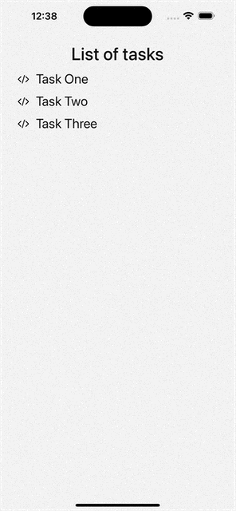

## Task One - TDD

### Context

The main purpose of this app is to manage a short list of items with filter.

Inside the folder `tasks/task1/__test__` you would find the test file `GenericSectionList.test.tsx` that is the test suite for the functionality of the generic component `GenericListScreen`. This test suite has two `describe` sections just to showcase that the generic component can work with different types of data. Each of the test cases explains the test scenario for the component, how it needs to behave and what it needs to perform. The components rendered on the screen are queried by `testId`s.

Further more we have two utils that are used in the test, that can be found inside `tasks/task1/screens/PrepareMovieScreen.tsx` and `tasks/task1/screens/PreparePeopleScreen.tsx` which use the generic component and prepare the generic screens that are tested inside the test. You can check how we are expecting to use this generic component if you browse through the utils.

In this task you need to create screen with a SectionList component and a TextInput to filter the data with debounce. The entry point that needs to be updated can be found inside `task1/screens/GenericListScreen.tsx`.

### Goals

1. Implement the `GenericListScreen` screen to:

- get the data from the api using the `fetcher` property, as a generic array of items. Display the data as a SectionList, with a header to group the different list-items by the field `type`. The `renderItem` and the `keyExtractor` will be sent as properties
- add a TextInput to filter the data based on the `filterBy` property. Implement the logic to debounce, you have `lodash` installed and it can be used or create your own debounce function. The default value of the debounce time is 500ms
- there's some info about the testIDs you need to use in the test file

2. Make the test `GenericListScreen.test` pass

The ultimate goal of the task is to run `npm run test:final` and make all tests work

